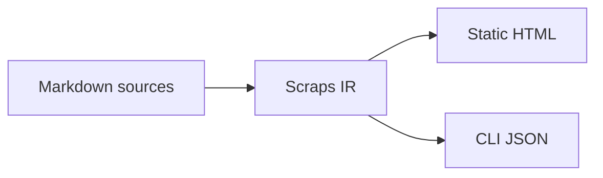

# はじめに

2023年5月から、ScrapsというWikiリンク記法向けの静的サイトジェネレーターCLIを作っています。Zennでも過去に何度か紹介をしてきました。

https://zenn.dev/boykush/articles/0b13f54335dbb7
https://zenn.dev/boykush/articles/1aa8848b23f09a
https://zenn.dev/boykush/articles/scraps-marketplace-plugin

最後の記事で紹介しているように、AIエージェントの台頭に合わせて都度MCPサーバー機能やAgent Skillsを提供し、拡充を行ってきました。

しかし、ツールのコアとなるビジョンについて思い悩む状況が続いていました。[Write the Docs](https://www.writethedocs.org/)コミュニティの考えと照らし合わせてビジョンを更新したりしましたが、AI時代に合わせた方針を打ち立てられていませんでした。

そこで見つけたgistが、Andrej Karpathy氏の「LLM Wiki」です。

https://gist.github.com/karpathy/442a6bf555914893e9891c11519de94f

このgistでは、LLMを用いたドキュメンテーション、あるいはナレッジ管理について論じられています。単にドキュメントを検索対象として扱うのではなく、LLMが継続的にメンテナンスするWikiとして育てていく考え方です。

日本語では以下の記事が参考になります。ObsidianとClaude CodeのSkillsを使った実践例として読めます。

https://zenn.dev/dely_jp/articles/8b55114cc0b958

LLM Wikiでは、主に以下のような操作でドキュメンテーションのライフサイクルを管理します。

- **Ingest**: 新しい記事、論文、メモなどの情報源を読み込み、既存のWikiに統合する。要約ページを作るだけでなく、関連ページの更新やリンク追加も行う。
- **Query**: Wikiに対して質問し、関連ページを検索・参照しながら回答を生成する。良い回答は、そのまま新しいWikiページとして保存することもできる。
- **Lint**: Wiki全体の健康状態を確認する。古くなった情報、孤立したページ、足りないリンク、矛盾した記述などを見つけ、継続的にメンテナンスする。

参考記事のように、これらのライフサイクルはClaude CodeのSkillsだけでも十分に運用できます。一方で、自分がScrapsを作っている立場から見ると、AIエージェントがWikiを扱うためのCLIツールも欲しくなりました。Karpathy氏のgistでも、Wikiが大きくなった場合に検索や取得のための小さなCLIツールを用意し、LLMがシェルから呼び出せるようにする方針に触れられています。

そこでScrapsのビジョンをLLM Wikiをベースに再定義し、破壊的変更を含めたv1リリースをしようと思い立ちました。

# ビジョンの再定義

新たに考えたtaglineは以下です。

> The Wiki-link doc compiler for the LLM era
>
> LLM時代のWikiリンクdocコンパイラ

descriptionとしては、以下のような表現を置いています。

> Scraps treats documentation like a programming language. Wiki-linked markdown becomes a typed source, compiling into a static site for readers and into JSON any agent can shell into.
>
> Scrapsはドキュメンテーションをプログラミング言語のように扱います。Wikiリンク付きMarkdownが型付きのsourceとなり、読み手向けの静的サイトと、AIエージェントがシェルから扱えるJSONへとコンパイルされます。

公式Docでの説明は以下です。

https://boykush.github.io/scraps/scraps/explanation/what-is-scraps-question.html

直近では「ナレッジハブ」とゆるく呼んでいましたが、v1ではより踏み込んで「Markdownコンパイラ」と位置づけ直しました。

# CLI/Lint ドキュメント品質を高速にチェックする

前提として、ScrapsではMarkdown内の `[[link]]` や `#[[tag]]` といったWiki-link記法を扱います。

LLM WikiにおけるLintは、Wikiを継続的に育てるための重要なプリミティブです。Scrapsでも、Wiki-linkの構造を検査するためのlintコマンドとrule群を用意しました。

| Rule | Detects | Default |
| --- | --- | --- |
| `broken-link` | 解決できない `[[link]]` | on |
| `dead-end` | リンク先を持たない文書 | on |
| `lonely` | どこからもリンクされていない文書 | on |
| `self-link` | 自分自身へのリンク | on |
| `overlinking` | 同じ `[[link]]` の過剰な繰り返し | on |
| `broken-heading-ref` | 存在しない見出しへの参照 | on |
| `stale-by-git` | Git履歴上、一定期間更新されていない文書 | opt-in |

たとえば `stale-by-git` では、Git履歴を使って一定期間更新されていない文書を検出できます。

:::details lint実行例
```bash
❯ scraps lint --rule stale-by-git
```

```text
warning[stale-by-git]: scrap not updated in 214 days
 --> docs/Reference/Old Design.md

warning: `scraps lint` generated 1 warning(s)
```
:::

`lint` は警告をすべて消すためのものではなく、目的に応じてruleを選び、Wikiの状態を見るための入口として扱っています。

同等のことはLLMに都度指示すれば達成できますが、当たり前に整備されたルールでCLI実行の方が高速です。


# CLI/Query AIエージェントに優しい文書クエリ

AIエージェントとの連携についてこれまでもMCPサーバー + Agent Skillsは提供してきましたが、LLM Wikiのアイディアをどう解決するかを考え直しました。まず主軸に置くことにしたのが、CLIコマンドとJSONアウトプットです。

CLIでJSONアウトプットを用意する案は、LLM WikiというよりGitHubのghコマンド、Datadogのpupコマンド等の動向に影響を受けています。

https://cli.github.com/
https://github.com/DataDog/pup

ghとpupどちらもAIエージェントに優しいJSONアウトプットでのCLI出力機能が豊富です。pupは特に公式ドキュメント相当のAgent Skillsをセットで配布したり、AIエージェント経由の実行を環境変数経由で判別しJSONアウトプットに自動で切り替えたりと完全にAIエージェントからの利用を想定したツールとなっています。

Scrapsでも、AIエージェントがMarkdownファイルを直接手探りするのではなく、CLI + JSONを通じて検索・取得・リンク確認を行えるようにしています。

### get

単一の文書を読む場合は `get` コマンドを使います。通常のFile Readとの大きな違いは、本文を読むかどうかも含めて、必要なフィールドだけを指定して取得できることでLLMコンテキストを節約する狙いです。 `gh issue view` コマンドを参考にしています。

```bash
❯ scraps get "Configuration" --json title,ctx,headings
```

```json
{
  "title": "Configuration",
  "ctx": "Reference",
  "headings": [
    {
      "level": 2,
      "text": "Areas",
      "line": 8
    },
    {
      "level": 2,
      "text": "Root level",
      "line": 22
    }
  ]
}
```

コード例だけが欲しい場合は、本文を読まずに `code_blocks` だけを取得できます。

```bash
❯ scraps get "Configuration" --json code_blocks
```

```json
{
  "code_blocks": [
    {
      "lang": "toml",
      "content": "output_dir = \"_site\"\n...",
      "line": 26
    }
  ]
}
```

### links

特定のScrapから貼られているリンクは `links` コマンドで取得できます。

```bash
❯ scraps links "What is Scraps?" --json
```

```json
{
  "results": [
    {
      "title": "Wiki-link Notation",
      "ctx": "Reference"
    },
    {
      "title": "CLI Overview",
      "ctx": "Reference"
    }
  ],
  "count": 2
}
```

### todo

Wiki全体の `- [ ]` マークダウン記法によるTODOも構造として取得できます。

```bash
❯ scraps todo --status all --json
```

```json
{
  "results": [
    {
      "scrap": {
        "title": "Release Checklist",
        "ctx": "Project"
      },
      "status": "open",
      "text": "Update documentation links",
      "line": 12
    }
  ],
  "count": 1
}
```

# AIプラグイン Ingest/Query/Lintの包括的な提供

CLIを用意するだけでは、LLM WikiのIngest / Query / Lintをそのまま実現できるわけではありません。特に書き込みであるIngestはCLIからは行わず、AIプラグインのみで行う方針を立てました。LLM Wikiに対応する新しいAIプラグインとして、Agent Skillsを再編しました。

https://github.com/boykush/scraps/tree/main/plugins/scraps

新プラグイン内のSkillsとAgentは、LLM Wikiのプリミティブに対応する形にしています。

| Primitive | Component | Role |
| --- | --- | --- |
| Ingest | `ingest` skill | 新しい文書を追加し、関連文書へのリンク更新と簡易lintを行う |
| Query | `query` skill | CLIで関連文書を検索・取得し、質問への回答を合成する |
| Lint | `lint-rule-handler` agent | 目的に応じてlint ruleを選び、Wiki healthを確認する |

`ingest` のワークフローはおおまかに以下のような流れです。

- URLやプロンプト、既存の回答Markdownを入力として受け取る
- `scraps search` や `scraps get` で関連する文書を確認する
- 新しいMarkdownを作成し、必要に応じて既存文書へリンクを追加する
- `scraps lint --rule broken-link` のようなlintチェックを行う

`query` は読み取り専用のSkillとして、以下のような流れにしています。

- `scraps search` で候補を探す
- `scraps get` で関連文書を読む
- 読み取った内容をもとに回答を合成する
- 良い回答を保存したい場合は、ユーザーが改めてingestへ渡す

`lint-rule-handler` はワークフローというより、自然言語の依頼を `scraps lint` のrule選択に落とし込むAgentです。たとえば「リンク切れを直したい」であれば `broken-link`、「古くなった文書を見つけたい」であれば `stale-by-git` のように、目的に応じて実行するruleを選びます。

# MCP

一方で、既存のMCPサーバー機能を消すわけではありません。MCP-compatibleなクライアントを使う場合には、引き続きMCPサーバーを利用できます。

https://github.com/boykush/scraps/tree/main/plugins/mcp-server

ただし、今回の再定義ではMCPを前面に出すのではなく、CLI + JSONを主軸として扱います。シェルを実行できるAIエージェントであれば、MCPクライアント実装や常駐サーバーなしに使えるためです。

# 人間向けの出力も残す

「Markdownコンパイラ」と言いつつも、もともとのSSGとしての出力を廃止したわけではありません。むしろ、人間向けの出力として明確に位置づけ直しました。



同じMarkdownソースを一度内部表現に落とし込み、そこから人間向けにはStatic HTML、AIエージェント向けにはCLIから取り出すJSONを生成します。Wiki-linkや見出し、タグといった構造を一度パースしてしまえば、出力先を増やすこと自体は素直に書けます。

# 既存ドキュメントへの組み込み

新しく専用のWikiを立ち上げるだけでなく、既存のMarkdownディレクトリにそのまま組み込めることも重視しました。

具体的には、対象ディレクトリに `.scraps.toml` を置くだけでScrapsの対象になります。専用のディレクトリ構造やファイル名のルールを強制せず、既存の `docs/` などにそのまま被せて使えるようにしています。

```toml
# docs/.scraps.toml

[ssg]
base_url = "https://example.com/docs/"
title = "My Docs"
```

設計のイメージとしては `mise.toml` に近いものを意識しています。プロジェクトのルートに小さな設定ファイルを置くだけで、その場所をツールが認識する、という薄い結合の作り方です。Wikiとして育てるにあたって、専用リポジトリを用意するか既存docsに混ぜるかは、書き手側の運用都合で選べたほうがよいと考えました。

あわせて、対象ディレクトリを指定するための `-C` (`--directory`) オプションも用意しています。`git -C` と同じく、ディレクトリを移動せずに指定先で実行したかのように扱えます。`SCRAPS_DIRECTORY` 環境変数でも同じ指定ができます。

```bash
❯ scraps -C docs build
❯ SCRAPS_DIRECTORY=docs scraps lint
```

# CIへの組み込み

v1ではGitHub Actionsから手軽に呼び出せるよう、`boykush/scraps` Actionを公開しました。

https://github.com/marketplace/actions/setup-scraps

composite actionとして、GitHub Releasesから対応プラットフォーム (Linux/macOS, x86_64/arm64) のバイナリを取得してPATHに通すだけのシンプルな構成です。これでGitHub Actions上で `scraps build` / `scraps lint` をそのまま呼び出せます。

```yaml
- uses: boykush/scraps@v1
- run: scraps build
- run: scraps lint
```

GitHub Pagesへのデプロイ方法は以下にまとめています

https://boykush.github.io/scraps/scraps/how-to/deploy-to-github-pages.html


# 後日談 - まとめ
v1の構想を練っている間や、本記事を書いている間にも関連話題の特筆すべきアップデートがあったので後日談的に軽く紹介です。

## Obsidian CLI
v1の構想を練っている間に、Obsidian CLIのリリースがあったことを知りました。CLIの有無は長い間Obsidianと差別化していた部分なので個人的に目を惹きました。

https://help.obsidian.md/cli

実際に触ってみつつ、今後の機能追加も楽しみにできればと思います。

## AIエージェントが書くHTML

記事を書いている最中に、Thariq氏の「Using Claude Code: The Unreasonable Effectiveness of HTML」の記事が出ました。AIエージェントが生成するアウトプット形式として、MarkdownではなくHTMLを推す内容です。

https://x.com/trq212/status/2052809885763747935

HTMLはテーブル・SVG・CSS・JavaScriptまで使えるためMarkdownより情報密度が高く、AIエージェントから人間への伝達手段として表現力が高い、というのが主な主張です。読み手にとって視覚的に読みやすく、共有もしやすいという論点もあります。

## さいごに

上記の様な関連話題もあり「いよいよ個人のツール開発も潮時かな」と考えたのですが、LLM WikiのようなAIネイティブな包括的なドキュメント管理を考えていくとまだまだやりたいことがあり機能開発も捗りました。

AI時代は誰でも手元でツールを作ることができるので、引き続き機能拡充を楽しく、変化に柔軟に行ければと思います。

最後まで読んでいただきありがとうございました！
